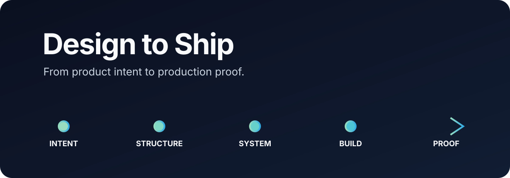

<p align="center">
  
</p>

<p align="center">
  <strong>An open, agent-ready product design workflow that connects requirements, UX, visual systems, implementation, and proof.</strong>
</p>

<p align="center">
  <a href="https://github.com/manmeetnain/design-to-ship/actions/workflows/validate.yml"></a>
  <a href="LICENSE"></a>
  
  
</p>

---

Design to Ship turns a loose idea, PRD, design file, or existing interface into a **traceable product direction**, an **implementation contract**, and an **evidence-backed readiness verdict**.

```text
Intent  →  Structure  →  System  →  Build  →  Proof
   why          how       language     reality    evidence
```

Most design resources stop at inspiration. Most design-to-code tools begin after the consequential product decisions have already been made. Design to Ship keeps the reasoning connected from the first requirement to the last verification result.

## The difference

| Typical AI design workflow | Design to Ship |
|---|---|
| Starts with a visual style | Starts with product intent and evidence |
| Designs the happy path | Covers alternate, empty, loading, error, permission, and recovery states |
| Produces isolated screens | Creates architecture, journeys, systems, and a build contract |
| Defaults to fashionable aesthetics | Requires a product reason for consequential choices |
| Calls generated output “done” | Requires observable proof against acceptance criteria |
| Hides assumptions in fluent prose | Labels claims as confirmed, inferred, proposed, unknown, or conflicting |

This is not a UI kit, trend catalog, or prompt that promises magic. It is the missing operating layer between product thinking and production work.

## Quick start

Give your agent a product idea, brief, PRD, Figma link, screenshot, or repository and ask:

```text
Use $design-to-ship in FULL mode.

Take this product from requirements through UX architecture, design direction,
implementation planning, and evidence-based verification:

[paste the brief or attach the relevant artifact]
```

The full paste-ready version lives in the [prompt cookbook](skills/design-to-ship/references/prompt-cookbook.md).

## Install

Design to Ship uses a canonical open-format skill and thin host adapters.

### Gemini CLI

```bash
gemini skills install https://github.com/manmeetnain/design-to-ship
```

### Codex and ChatGPT

Copy `skills/design-to-ship` to `.agents/skills/design-to-ship` for one repository or `~/.agents/skills/design-to-ship` for personal use. The repository also contains a Codex plugin manifest.

### Claude Code

Copy `skills/design-to-ship` to `.claude/skills/design-to-ship` for one repository or `~/.claude/skills/design-to-ship` for personal use. Invoke it with `/design-to-ship`.

### Cursor

Install this repository as a Cursor plugin. Its manifest exposes the canonical `skills/` directory. Cursor can also consume `AGENTS.md` as project guidance.

### GitHub Copilot

This repository includes `.github/copilot-instructions.md` and `AGENTS.md`. Copy the adapter and canonical skill into a target repository, or explicitly attach the workflow in Copilot Chat.

See the [compatibility matrix](docs/compatibility.md) for supported surfaces and the [models-and-hosts guide](docs/models-and-hosts.md) for the model-agnostic architecture.

## One workflow, six modes

| Mode | Use it to | Expected result |
|---|---|---|
| `EXPLORE` | Turn an early idea into a testable direction | Outcomes, assumptions, risks, concept options |
| `DEFINE` | Structure known requirements | Architecture, journeys, states, content model |
| `DESIGN` | Establish the product's visual and behavioral language | Principles, tokens, components, responsive rules |
| `BUILD` | Translate approved intent into implementation | Component map, code guidance, acceptance criteria |
| `AUDIT` | Evaluate an existing design or build | Findings, scores, evidence, prioritized corrections |
| `FULL` | Run the complete path | A traceable package from intent to proof |

## The five quality gates

| Gate | Question | Pass condition |
|---|---|---|
| **Intent** | What outcome matters, for whom, and under which constraints? | Success can be explained without naming a UI pattern |
| **Structure** | How should people understand and move through the product? | Critical jobs include alternate and recovery paths |
| **System** | What reusable language fits the product? | Another designer can extend it without copying a screenshot |
| **Build** | How does intent become production behavior? | Engineers can implement without consequential guessing |
| **Proof** | Does the result work and fulfill its intent? | Evidence supports the acceptance criteria |

Every run ends with exactly one verdict: `READY`, `READY WITH RISKS`, `REVISE`, or `BLOCKED`.

## Built for agents, accountable to people

The workflow is model-agnostic and adapts to the host's real capabilities:

- **Reason:** Produce a brief, architecture, system direction, and build contract.
- **Inspect:** Ground decisions in repositories, screenshots, or design files.
- **Build:** Implement using the product's actual components and constraints.
- **Prove:** Exercise the interface and attach reproducible evidence.

An agent that can only reason must never claim that it visually or functionally verified the result.

## Repository map

```text
design-to-ship/
├── skills/design-to-ship/       Canonical Agent Skill
│   ├── SKILL.md                 Five-gate operating workflow
│   ├── agents/openai.yaml       OpenAI interface metadata
│   └── references/              Progressive design knowledge
├── docs/                        Method and compatibility
├── schemas/                     Machine-readable contracts
├── library/                     Product, UX, content, and anti-pattern intelligence
├── templates/                   Ready-to-copy project artifacts
├── examples/                    Worked examples
├── evals/                       Trigger and behavior cases
├── scripts/validate.py          Dependency-free validation
├── .codex-plugin/               Codex/OpenAI package metadata
├── .cursor-plugin/              Cursor package metadata
└── .github/                     Copilot adapter and CI automation
```

## Try the worked slice

The [calmer guest-checkout example](examples/focus-checkout.md) shows the core chain:

```text
E-01 evidence
  └── R-01 requirement
       └── D-01 design decision
            └── acceptance criterion
                 └── verification method
```

## Design principles

1. Product truth before visual polish.
2. Decisions remain traceable.
3. Every important state deserves design.
4. Accessibility and resilience are design quality.
5. Distinctiveness needs a product reason.
6. Verification requires evidence.
7. “Unknown” is an honest and useful answer.

## Contributing

Start with [CONTRIBUTING.md](CONTRIBUTING.md). New guidance must identify its context, intended outcome, counterexample, and verification method. Run:

```bash
python3 scripts/validate.py
```

The [roadmap](ROADMAP.md) prioritizes tested workflows, machine-readable contracts, and grounded product playbooks over an unmaintainable pile of design links.

## License

[MIT](LICENSE) © 2026 Design to Ship contributors.
